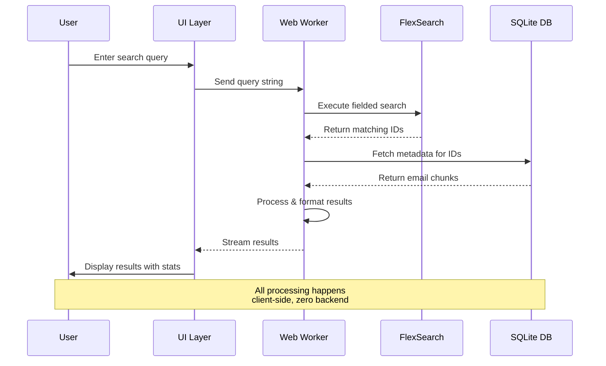
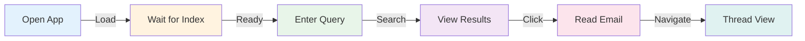
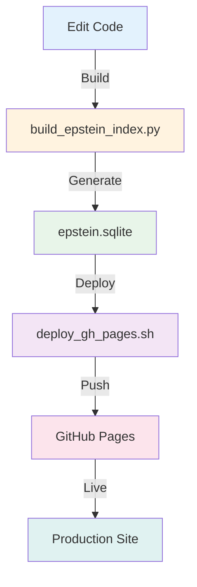
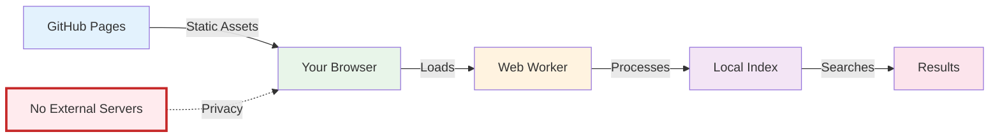

# EES — Epstein Emails Search

<div align="center">

```
███████╗██████╗ ███████╗████████╗███████╗██╗███╗   ██╗
██╔════╝██╔══██╗██╔════╝╚══██╔══╝██╔════╝██║████╗  ██║
█████╗  ██████╔╝███████╗   ██║   █████╗  ██║██╔██╗ ██║
██╔══╝  ██╔═══╝ ╚════██║   ██║   ██╔══╝  ██║██║╚██╗██║
███████╗██║     ███████║   ██║   ███████╗██║██║ ╚████║
╚══════╝╚═╝     ╚══════╝   ╚═╝   ╚══════╝╚═╝╚═╝  ╚═══╝
                                                      
  ▓█████  ███▄ ▄███▓ ▄▄▄       ██▓ ██▓      ██████ 
  ▓█   ▀ ▓██▒▀█▀ ██▒▒████▄    ▓██▒▓██▒    ▒██    ▒ 
  ▒███   ▓██    ▓██░▒██  ▀█▄  ▒██▒▒██░    ░ ▓██▄   
  ▒▓█  ▄ ▒██    ▒██ ░██▄▄▄▄██ ░██░▒██░      ▒   ██▒
  ░▒████▒▒██▒   ░██▒ ▓█   ▓██▒░██░░██████▒▒██████▒▒
  ░░ ▒░ ░░ ▒░   ░  ░ ▒▒   ▓▒█░░▓  ░ ▒░▓  ░▒ ▒▓▒ ▒ ░
   ░ ░  ░░  ░      ░  ▒   ▒▒ ░ ▒ ░░ ░ ▒  ░░ ░▒  ░ ░
     ░   ░      ░     ░   ▒    ▒ ░  ░ ░   ░  ░  ░  
     ░  ░       ░         ░  ░ ░      ░  ░      ░  
                                                   
```

[](LICENSE)
[](https://github.com/dicklesworthstone/ees/stargazers)
[](https://github.com/dicklesworthstone/ees/network)
[](https://github.com/dicklesworthstone/ees/issues)
[](https://github.com/dicklesworthstone/ees/commits/main)

**Client-side • Zero-backend • Privacy-first**

[🚀 Live Demo](https://dicklesworthstone.github.io/ees/) • [📖 Documentation](#-using-it) • [🔧 Development](#-local-dev)

</div>

---

Welcome to **EES** — the premier way to explore Epstein's sick world, as encapulated by his emails to scores of famous and prominent people. All with a slick, client‑side, zero‑backend way to slice, dice, and spelunk the notorious Epstein email corpus. 

## 🎨 Why it feels premium
- **Glass & glow**: Gradient hero, stat tiles, pill toggles, and neon hover cues tuned for that "Stripe, but for evidence" vibe.
- **Space Grotesk everywhere**: Modern typography that makes even plaintext headers look boardroom‑ready.
- **Kinetic feedback**: Centered loading veil, real‑time result counts, and smooth selection halos keep you oriented while you dig.

<details>
<summary><b>📊 Architecture Overview</b></summary>

```mermaid
graph TB
    A[User Browser] -->|Loads| B[index.html]
    B -->|Spawns| C[Web Worker]
    C -->|Fetches| D[meta.sqlite<br/>hot meta]
    C -->|Fetches| J[text.pack<br/>compressed bodies]
    C -->|Loads| E[sql.js<br/>SQLite WASM]
    C -->|Loads| F[pako + fflate<br/>Decompression]
    C -->|Builds| G[FlexSearch Index (lite→full)]
    D -->|Query| E
    J -->|Decompress on demand| F
    E -->|Results| G
    G -->|Search Results| C
    C -->|Streams| B
    B -->|Renders| H[UI Components]
    H -->|User Interaction| I[Search Queries]
    I -->|Sends| C
    
    style A fill:#e1f5ff
    style B fill:#fff4e1
    style C fill:#e8f5e9
    style D fill:#f3e5f5
    style E fill:#fff3e0
    style F fill:#fff3e0
    style G fill:#e3f2fd
    style H fill:#fce4ec
    style I fill:#e0f2f1
```

</details>

## 🧠 Under the hood

### Core Components

| Component | Technology | Purpose |
|-----------|-----------|---------|
| **Database** | SQLite (sql.js) | `meta.sqlite` (hot meta: docs, timeline, people, threads) |
| **Text Pack** | Custom brotli pack | `text.pack` with compressed bodies, fetched once and read by offset |
| **Search Engine** | FlexSearch | Fast, client-side full-text search with fielded queries |
| **Compression** | pako + fflate (brotli) | Fast decompression of body text on demand |
| **Worker** | Web Worker API | Background processing to keep UI responsive |
| **UI Framework** | Vanilla JS | Zero-dependency, lightweight interface |

- **Hot/cold split**: `meta.sqlite` (small, fast) + `text.pack` (compressed brotli blobs by offset) keep first render light.
- **Lite-first indexing**: The worker instantly builds a lite index (subject/from/to/preview/domains) so search is usable immediately; a full-text index builds silently in the background and swaps in when ready.
- **On-demand text**: Body text stays in `text.pack`; the worker inflates only what you open, with an LRU cache for repeat reads.
- **All in the worker**: `search-worker.js` runs SQLite via sql.js, pako/fflate, and FlexSearch — zero server calls, zero telemetry.
- **Fielded search DSL**: `subject:`, `from:`, `to:`, `body:`, boolean `AND/OR/NOT`, and date ranges like `date:[2001-01-01 TO 2005-12-31]` — precision sleuthing by default.
- **People & threads**: Reconstructed threads, co-participant stats, domains, and quick “view whole thread” actions right in the UI.
- **Timeline at a glance**: Mini histogram to timebox your hunts without leaving the pane.

<details>
<summary><b>🔄 Search Workflow</b></summary>



</details>

## 🚀 Using it

### Quick Start



### Step-by-Step Guide

1. **Open the application**: Navigate to [https://dicklesworthstone.github.io/ees/](https://dicklesworthstone.github.io/ees/)
2. **Wait for initialization**: The worker hydrates the index (watch the centered spinner)
3. **Start querying**: Mix fields and boolean ops, then refine with filename, date, and kind filters
4. **Explore results**: Click any result to read the chunk; hop chunks, stitch full messages, or view entire threads inline

### Search Query Examples

| Query Type | Example | Description |
|------------|---------|-------------|
| **Fielded Search** | `subject:meeting` | Search within subject line |
| **From/To** | `from:jeffrey.epstein` | Filter by sender |
| **Boolean** | `subject:meeting AND from:jeffrey.epstein` | Combine conditions |
| **Date Range** | `date:[2001-01-01 TO 2005-12-31]` | Filter by date range |
| **Body Search** | `body:confidential` | Search email content |

## 📦 Local dev

### Development Workflow



### Commands

```bash
# Rebuild the SQLite database bundle
uv run build_epstein_index.py

# Deploy to GitHub Pages (ships index.html, worker, vendor, sqlite)
./deploy_gh_pages.sh
```

### Project Structure

```
ees/
├── data/
│   └── epstein.sqlite          # Main database (~69 MB)
├── epstein_emails_explorer.html # Main UI
├── search-worker.js             # Web Worker for search
├── build_epstein_index.py       # Database builder
└── deploy_gh_pages.sh           # Deployment script
```

## 🔒 Privacy & footprint

### Privacy Features

| Feature | Description |
|---------|-------------|
| **Zero Backend** | No server calls beyond fetching assets; everything processes client-side |
| **Local Processing** | All indexing happens in your browser/worker |
| **No Tracking** | No analytics, beacons, or data collection |
| **Vendored Dependencies** | `flexsearch`, `pako`, `sql.js` served locally for reliability |

### Data Flow



**Key Points:**
- ✅ No backend calls beyond fetching the shipped assets; everything indexes in your browser/worker
- ✅ Vendored `flexsearch`, `pako`, `sql.js` served locally for reliability
- ✅ Complete privacy — your searches never leave your device


## 🛠️ Tech Stack

<div align="center">

| Category | Technology |
|----------|-----------|
| **Database** |  |
| **Search** |  |
| **Compression** |  |
| **Runtime** |  |
| **Language** |  |
| **Hosting** |  |

</div>

## ✨ One-liner

> **EES** is the luxe, zero-server, FOIA spelunker for people who want elite tooling to navigate sordid inbox history.

---

<div align="center">

**Made with ❤️ for transparency and accountability**

[⬆ Back to Top](#ees--epstein-emails-search)

</div>
